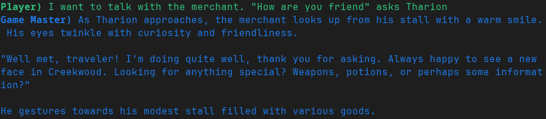

# CLI RPG Game
Play a :crossed_swords: TTRPG game :crossed_swords: in your terminal with a LLM :robot: as the Game Master - scheduling conflicts no more!

<!-- TODO Maybe put a video or a gif of the "gameplay" instead of a static image -->
---

---

## Launching
### Prerequisites:
- Python 3.10+
- The following Python libraries:
    - dotenv
    - openai
    - fastmcp
    - sqlite3
    - uvicorn
- OpenAI API key (valid to use with the gpt-4.1-nano model)

### [MCP Server](server/server.py)
To launch the MCP server please launch the [server.py](server/server.py) script. 
The script has the following launch options:
- -h, --help           Show this help message and exit
- --host &lt;HOST&gt;  Bind Host
- --port &lt;PORT&gt;  Bind Port
- --verbose            Enable stdout logging
- --soft_restart_db    Resets database entries for fresh, identical start of the adventure
> Default value for the host address is `0.0.0.0`
> Default value for the port is `8080`

### [Client](client/client.py)
> [!WARNING]  
> The client.py script **WILL NOT** run without a server to connect to!

To launch the Client program please launch the [client.py](client/client.py) script. 
The script has the following launch options:
- -h, --help            show this help message and exit
- --api_key_file &lt;API_KEY_FILE&gt; (Legacy - use .env file) Path to the file with the api key to the LLM
- --api_key &lt;API_KEY&gt;     (Legacy - use .env file) The api key to the LLM
- --verbose             Enable stdout logging

---

# Some more detailed info

The approximate architercture of the system is represented on the image below:  

  
The user interacts with via the [client](client/client.py) using prompts  with the LLM - like they would with a "human game master". The LLM is exposed to the database with the game info via the MCP (MCP client is embedded in the [client](client/client.py), and the [MCP server](server/server.py) is separate). 

## [Client](client/)
The game's client was designed as a simple CLI application. 

The program was written in Python; and the main libraries used in the program are:
- FastMCP - Apache 2.0 license - as the library used for the program's communication with the MCP server,
- OpenAI - Apache 2.0 license - the official library for interacting with the OpenAI API,
- cmd - PSFL license - a library, in a slightly modified version for the project, for creating simple console interfaces (CLI).

The main functionality of the client application is the interaction of the user (described as a “player”) with the LLM model (described as a “game master”) in the form of chat - the idea is that the user should be able to talk to the LLM model as with a regular human game master.

The client uses OpenAI's gpt-4.1-nano model, due to the low fees, but it can be easily changed to a different model by changing the line: `model = "gpt-4.1-nano",` in the [client.py:107](client/client.py), to something else.

---

## [MCP Server](server/)
The system's MCP server was written in Python, mainly using libraries:
- FastMCP - Apache 2.0 license - as the library used to build the actual MCP server,
- sqlite3 - PSFL license - as the library for interacting with the SQLite system management database.
- Uvicorn - a lightweight ASGI server, used for web applications based on FastAPI or Starlette frameworks.

The role of the server is to provide access to tools, resources and initial instructions for the model.
The server creates an endpoint for communication and exposes it on a selected (in the test case - locally accessible) port.

### Database
A database was used for this project not only to test out the MCP, but also to have a persistent and "solid" storage of important for the "game master" informations, that the game master (LLM) would not have to hallucinate every time someone played.

The logic supporting the database has been separated from the server logic and encapsulated in its own class. This forces the server to use the access methods provided in the Database class. The Database class, also created with efficient testing in mind, provides functionalities such as:
- Creating tables in the database
- Soft and hard reset of the database, cleaning the contents of the tables and deleting all tables
- Executing SQL commands on the database with error handling
- Initializing the database, by entering sample contents into the tables

The ability to reset the database to the initial state was used as part of the tests.
The database consists of 6 tables: characters, items, loot (maps the relationship n to n), enemies, npc and locations:

### Tools
The MCP server offers such *tools* like:
- query_playable_characters - returns a list of characters the player can play
- create_and_add_new_character - LLM queries the user for data (name, class, race, number of health points) and then passes it to this tool, which creates a new line representing the player's character
- get_alive_enemies_in_location - returns a list of enemy characters in a given (by ID) location
- assign_item_to_character_equipment - assigns the selected (given by ID) inventory item to the selected character (given by ID)

> The LLM is *generally* good at using the MCP tools, however it can (with varying frequency) forget / hallucinate / input incorrect data when calling the MCP tools, resulting in a "good tool call", but with incorrect arguments

---

# [License](LICENSE)
MIT © [Eques72](https://github.com/Eques72),  [eccentricfae](https://github.com/eccentricfae)